# 👑 HIEU CEO - Master Website Interface & Interactive Live Multi-Device Hub

<div align="center">


<br>

**Hệ Thống Quản Lý Giao Diện Website & Trình Xem Live Dự Án Tương Tác Chuẩn Điều Hành Quốc Tế**  
*Tích hợp thư mục lưu trữ tập trung `projects/`, trình giả lập đa thiết bị 4-in-1 (Desktop Full, iMac Studio, iPad Pro xoay ngang dọc, iPhone 15 Pro Dynamic Island), Cổng thành viên trải nghiệm (Đăng ký, Đăng nhập, Yêu thích, Đánh giá), Trình tải lên ZIP tự động giải nén & Đăng ký CSDL.*

[🚀 Trải Nghiệm Xem Live](http://127.0.0.1:8099/live-view.php) • [🧭 Khám Phá Dự Án](http://127.0.0.1:8099/explore.php) • [👤 Cổng Thành Viên](http://127.0.0.1:8099/user-login.php) • [👑 Quản Trị CEO](http://127.0.0.1:8099/admin/index.php)

---

</div>

## 📑 Mục Lục Chi Tiết

1. [🌟 Giới Thiệu & Các Điểm Nhấn Đột Phá](#-1-giới-thiệu--các-điểm-nhấn-đột-phá)
2. [📁 Hệ Sinh Thái Các Dự Án Trong `projects/`](#-2-hệ-sinh-thái-các-dự-án-trong-projects)
3. [📱 Trình Xem Live Đa Thiết Bị Tương Tác (`live-view.php`)](#-3-trình-xem-live-đa-thiết-bị-tương-tác-live-viewphp)
4. [👤 Phân Hệ Người Dùng & Thành Viên (User Portal)](#-4-phân-hệ-người-dùng--thành-viên-user-portal)
5. [👑 Phân Hệ Quản Trị Điều Hành CEO (Admin Suite)](#-5-phân-hệ-quản-trị-điều-hành-ceo-admin-suite)
6. [🔐 Danh Sách Tài Khoản Thử Nghiệm](#-6-danh-sách-tài-khoản-thử-nghiệm)
7. [🚀 Hướng Dẫn Cài Đặt & Khởi Chạy Nhanh](#-7-hướng-dẫn-cài-đặt--khởi-chạy-nhanh)
8. [🌐 Danh Sách Các Đường Dẫn Hệ Thống](#-8-danh-sách-các-đường-dẫn-hệ-thống)
9. [🔌 Hệ Thống RESTful API Tích Hợp](#-9-hệ-thống-restful-api-tích-hợp)
10. [📂 Sơ Đồ Cấu Trúc Toàn Bộ Dự Án](#-10-sơ-đồ-cấu-trúc-toàn-bộ-dự-án)
11. [🛡️ Kiến Trúc Kỹ Thuật & Tiêu Chuẩn Bảo Mật](#-11-kiến-trúc-kỹ-thuật--tiêu-chuẩn-bảo-mật)

---

## 🌟 1. Giới Thiệu & Các Điểm Nhấn Đột Phá

**HIEU CEO Theme Hub** là giải pháp phần mềm quản trị và điều phối giao diện website được thiết kế chuyên biệt cho Ban Lãnh Đạo (CEO / CDO / Giám đốc Công nghệ) và Thành viên trải nghiệm. Hệ thống giải quyết bài toán quản lý tập trung hàng loạt website độc lập trong một nền tảng thống nhất với các tính năng vượt trội:

```mermaid
graph TD
    A[👑 HIEU CEO Master Portal] --> B[🚀 Trình Xem Live Đa Thiết Bị live-view.php]
    A --> C[📁 Kho Lưu Trữ projects/]
    A --> D[👤 Cổng Thành Viên User Portal]
    A --> E[🛡️ Bảng Điều Khiển Quản Trị CEO Admin]
    
    B --> B1[Desktop Studio 1280px]
    B --> B2[iPad Pro 768x1024 / Xoay Ngang]
    B --> B3[iPhone 15 Pro Dynamic Island]
    B --> B4[Mã QR Quét Trên Smartphone]
    
    C --> C1[HieuWeb01 - Thời Trang]
    C --> C2[HieuWeb02 - Nhà Sách]
    C --> C3[HieuWeb03 - Nội Thất]
    C --> C4[DatCyber - Đồ Gia Dụng]
    C --> C5[HieuWeb05 - Gym & Fitness]
    C --> C6[HieuCyberPortfolio - Tech SaaS]
    C --> C7[Tải lên ZIP Tự Động Giải Nén]
    
    D --> D1[user-register.php Đăng Ký]
    D --> D2[user-login.php Đăng Nhập 1-Click]
    D --> D3[user-dashboard.php Yêu Thích & Lịch Sử]
```



### 💎 Điểm Nhấn Công Nghệ
- **Thư mục lưu trữ dự án tập trung (`projects/`)**: Tất cả các website được chứa độc lập trong thư mục `projects/`, mỗi website là một ứng dụng web hoàn chỉnh có tệp khởi chạy `index.php` / `index.html`.
- **Tải lên tệp ZIP tự động giải nén (`admin/project-upload.php`)**: Hỗ trợ kéo-thả tệp nén `.ZIP` của bất kỳ website nào, hệ thống tự động giải nén an toàn, phát hiện tệp entry, đọc tài liệu `README.md` và tự động đăng ký vào CSDL để hiển thị trực tiếp.
- **Trình xem Live đa thiết bị 4-in-1 (`live-view.php`)**: Trải nghiệm xem trước tương tác thời gian thực chuẩn Apple Studio Display, iPad Pro và iPhone 15 Pro có Dynamic Island & Home Bar.
- **Phân hệ Thành viên tương tác**: Cho phép người dùng đăng ký tài khoản mới, thả tim yêu thích giao diện (AJAX), chấm điểm đánh giá (1-5 sao) và quản lý lịch sử xem.
- **Ngôn ngữ thiết kế Ultra-Luxury Glassmorphism**: Hiệu ứng kính mờ sang trọng, bảng màu Neon phát sáng, ánh sáng nền Ambient Light thay đổi theo từng dự án, chuyển động mượt mà 60 FPS.

---

## 📁 2. Hệ Sinh Thái Các Dự Án Trong `projects/`

Hệ thống tích hợp sẵn 6 bộ dự án website thương mại điện tử và công nghệ hoàn chỉnh trong thư mục `c:\Users\tranv\Desktop\DoAnWebsite\projects\`:

| Thư Mục Dự Án | Tên Giao Diện & Thương Hiệu | Ngành Nghề & Lĩnh Vực | Tính Năng Nổi Bật Chính | Tài Khoản Thử Nghiệm Mặc Định |
| :--- | :--- | :--- | :--- | :--- |
| **`HieuWeb01`** | **HieuMini Luxury Fashion Studio** | Thời Trang & May Mặc May Đo | • Hero Slider bộ sưu tập<br>• Flash Sale đếm ngược<br>• Bảng Size Guide chuẩn<br>• Giỏ hàng thanh toán VietQR MBBank<br>• Xuất hóa đơn điện tử | **Admin:** `admin@hieumini.vn`<br>**Khách:** `khachhang@gmail.com`<br>*(Pass: `admin123`)* |
| **`HieuWeb02`** | **Hieu Bookstore Hub** | Nhà Sách & Thư Viện Tri Thức Số | • Đọc thử trích đoạn sách<br>• Đánh giá sao độc giả<br>• Bộ lọc thể loại đa tầng<br>• Mã giảm giá FREESHIP<br>• Tra cứu vận đơn | **Admin:** `admin@hieubooks.vn`<br>**Khách:** `docgia@gmail.com`<br>*(Pass: `admin123`)* |
| **`HieuWeb03`** | **Hieu Living & Scandinavian Decor** | Nội Thất Bắc Âu & Không Gian Sống | • Showroom 3D góc rộng<br>• Bộ sưu tập phòng Living / Bed / Office<br>• Tư vấn thiết kế cá nhân hóa<br>• Báo giá vật liệu cao cấp | **Admin:** `admin@hieuliving.vn`<br>**Khách:** `khachhang@gmail.com`<br>*(Pass: `admin123`)* |
| **`DatCyber`** | **DatCyber Smart Home Appliances** | Thiết Bị Gia Dụng Thông Minh & Tiện Ích Gia Đình | • Nồi chiên, robot hút bụi, máy ép chậm<br>• Flash Sale đếm ngược<br>• Giỏ hàng AJAX mượt mà<br>• Quản trị sản phẩm, đơn hàng | **Admin:** `admin@datcyber.vn`<br>**Khách:** `khachhang@gmail.com`<br>*(Pass: `123456`)* |
| **`HieuWeb05`** | **Hieu Pro Gym & Athletic Matrix** | Thể Hình Đỉnh Cao & Dinh Dưỡng | • Máy tính chỉ số BMI khoa học<br>• Cửa hàng Whey Isolate & Creatine<br>• Đặt lịch HLV cá nhân (PT)<br>• Lịch tập luyện 7 ngày | **Admin:** `admin@hieugym.vn`<br>**Khách:** `hoi_vien@gmail.com`<br>*(Pass: `admin123`)* |
| **`HieuCyberPortfolio`** | **Hieu Cyber Portfolio Pro** | Công Nghệ Cao & Hồ Sơ Năng Lực | • Trình chiếu dự án Cyberpunk<br>• Glassmorphism tối ưu tốc độ<br>• Tương thích 100% thiết bị<br>• Animation hạt particle | **Admin:** `ceo@hieu.vn`<br>**Khách:** `guest@hieu.vn`<br>*(Pass: `admin123`)* |

---

## 📱 3. Trình Xem Live Đa Thiết Bị Tương Tác (`live-view.php`)

Trình xem Live là không gian làm việc và trải nghiệm sản phẩm trực tiếp với các tính năng:

```
+-----------------------------------------------------------------------------------------------+
| [<-] [ Chọn Website v ]    [ Full Canvas ] [ Desktop ] [ Tablet ] [ Mobile ]    [<3 Thích] [i Specs] [QR] [⭐] [Open] |
+-----------------------------------------------------------------------------------------------+
|                                                                                               |
|     +---------------------------------- Dynamic Island ---------------------------------+    |
|     |  * [Browser Bar / Dynamic Island / Bezel Frame]                                   |    |
|     |                                                                                   |    |
|     |  [  NỘI DUNG WEBSITE TRONG projects/<du_an>/index.php CHẠY THỜI GIAN THỰC  ]      |    |
|     |                                                                                   |    |
|     |                                                                                   |    |
|     |  * [iOS Home Indicator]                                                           |    |
|     +-----------------------------------------------------------------------------------+    |
|                                                                                               |
+-----------------------------------------------------------------------------------------------+
```

1. **Bộ Điều Khiển Kích Thước Khung Nhìn (Multi-Viewport Simulator)**:
   - **Full Canvas**: Xem website 100% diện tích màn hình, không viền.
   - **Desktop Studio Display**: Kích thước 1280px × 800px với thanh địa chỉ URL và đèn báo trạng thái.
   - **iPad Pro Tablet**: Kích thước 768px × 1024px, kèm nút **Xoay Ngang / Dọc** (Landscape 1024px × 768px).
   - **iPhone 15 Pro Mobile**: Kích thước 393px × 852px, viền máy chuẩn Apple, **Dynamic Island** phát sáng và thanh Home Bar.
2. **Bộ Chuyển Đổi Dự Án Thời Gian Thực (Live Switcher)**:
   - Menu thả xuống cho phép nhảy ngay lập tức sang website khác mà không cần chuyển trang.
   - **Drawer Danh Sách Kéo Ra Từ Cạnh Phải**: Tìm kiếm tức thì và chọn website.
3. **Tiện Ích Tương Tác Cao Cấp**:
   - **Thả Tim Yêu Thích (Heart Button)**: Hiệu ứng nổ tim lấp lánh và lưu vào tài khoản qua AJAX.
   - **Xem Tech Specs & Tài Khoản Demo**: Hộp thoại hiển thị các công nghệ tích hợp, tính năng và tài khoản Admin/Customer sẵn sàng copy.
   - **Tạo Mã QR Tức Thì (Mobile QR Code)**: Tự động sinh mã QR để mở camera điện thoại quét và chạy thẳng trên smartphone.
   - **Đánh Giá Sao 1-5⭐**: Gửi nhận xét và cập nhật điểm đánh giá trung bình.
   - **Làm Mới Live & Mở Tab Mới**: Thao tác tải lại khung iframe hoặc mở trực tiếp trên thanh địa chỉ.

---

## 👤 4. Phân Hệ Người Dùng & Thành Viên (User Portal)

Phân hệ dành riêng cho Khách hàng, Độc giả và Thành viên trải nghiệm (tập trung gọn gàng trong thư mục `user/`):

### 1. Đăng Ký Thành Viên Mới ([`user/register.php`](file:///c:/Users/tranv/Desktop/DoAnWebsite/user/register.php))
- Giao diện kính mờ hiện đại với form đăng ký tài khoản nhanh chóng.
- Cho phép lựa chọn ảnh đại diện Avatar (Phi Hành Gia, VIP, Designer, Coder).
- Mật khẩu được mã hóa an toàn với chuẩn **BCRYPT** `password_hash()`.
- Tự động đăng nhập và phân quyền `viewer` / `customer` sau khi đăng ký thành công.

### 2. Đăng Nhập Thành Viên ([`user/login.php`](file:///c:/Users/tranv/Desktop/DoAnWebsite/user/login.php))
- Hỗ trợ **1-Click Đăng Nhập Nhanh** với các tài khoản mẫu định sẵn.
- Cơ chế chuyển hướng thông minh (`redirect` parameter): Sau khi đăng nhập, hệ thống tự động đưa người dùng quay lại đúng trang hoặc dự án đang xem dở.

### 3. Bảng Điều Khiển Cá Nhân ([`user/dashboard.php`](file:///c:/Users/tranv/Desktop/DoAnWebsite/user/dashboard.php))
- **Dự Án Yêu Thích Của Tôi**: Quản lý toàn bộ danh sách các website đã bấm yêu thích kèm nút "Xem Live Đa Thiết Bị" và nút "Gỡ Yêu Thích".
- **Lịch Sử Xem Live Gần Đây**: Xem lại các website đã khám phá kèm mốc thời gian chi tiết.
- **Cài Đặt Hồ Sơ & Đổi Mật Khẩu**: Cập nhật thông tin cá nhân và thay đổi mật khẩu tài khoản trực quan.

---

## 👑 5. Phân Hệ Quản Trị Điều Hành CEO (Admin Suite)

Dành riêng cho Ban Điều Hành cấp cao quản lý toàn bộ hệ thống website:

1. **Bảng Điều Khiển Tổng Quan (`admin/index.php`)**:
   - Thống kê chỉ số KPI, số lượng giao diện đang vận hành, tổng dung lượng disk size trong `projects/`, lượt xem và lượt tải.
2. **Quản Lý Kho Thư Mục Dự Án (`admin/projects.php`)**:
   - Quét toàn bộ thư mục trong `projects/`, hiển thị dung lượng disk size, số lượng tập tin, tệp entry (`index.php`/`index.html`).
   - Nút 1-Click "Đăng Ký Lên Trang Chủ", "Xem Thử" và "Xóa Thư Mục".
3. **Tải Lên Dự Án Mới (.ZIP) (`admin/project-upload.php`)**:
   - Kéo thả tệp nén `.ZIP` (lên đến 100MB), tự động giải nén an toàn và tự động phát hiện thông tin đăng ký vào CSDL.
4. **Trình Tùy Biến Giao Diện Trực Quan (`customizer.php`)**:
   - Tinh chỉnh bảng màu thương hiệu (Primary, Secondary, Accent, Background), thay đổi Typography (Outfit, Plus Jakarta Sans, Montserrat, Cinzel) và bật/tắt các Section trong thời gian thực.
5. **Thống Kê Chuyên Sâu & A/B Testing (`admin/analytics.php`)**:
   - Đo lường chỉ số chuyển đổi, lưu lượng truy cập và chỉ số tốc độ Core Web Vitals (LCP, FID, CLS).
6. **Thư Viện UI Kit Đẳng Cấp (`admin/components.php`)**:
   - Kho nút bấm Neon phát sáng, thẻ 3D Tilt, thẻ thống kê LED, 1-click Copy Code HTML/CSS.

---

## 🔐 6. Danh Sách Tài Khoản Thử Nghiệm

Hệ thống đã nạp sẵn các tài khoản mẫu với mật khẩu mặc định: `admin123`.

### Tài Khoản Ban Điều Hành & Quản Trị (Admin Portal)
| Phân Quyền | Họ Và Tên | Email Đăng Nhập | Mật Khẩu | Quyền Hạn |
| :--- | :--- | :--- | :--- | :--- |
| 👑 **CEO (Chief Executive Officer)** | **HIEU TRAN** | `ceo@hieu.vn` | `admin123` | Toàn quyền kiểm soát hệ thống, kích hoạt theme, phân quyền |
| 🎨 **CDO (Chief Design Officer)** | **Elena Vance** | `cdo@hieu.vn` | `admin123` | Quản lý giao diện, tùy biến màu sắc/font chữ, UI Kit |
| 💻 **Lead Architect** | **Alex Thorne** | `dev@hieu.vn` | `admin123` | Tùy biến mã CSS/JS, quản lý Section, dọn dẹp cache |
| 👁️ **VIP Observer / Guest** | **Khách Thăm Quan** | `guest@hieu.vn` | `admin123` | Trải nghiệm xem trước, lưu yêu thích và đánh giá |

### Tài Khoản Mẫu Trải Nghiệm Từng Dự Án (Trong `projects/`)
| Dự Án Website | Tài Khoản Quản Trị (Admin) | Tài Khoản Khách Hàng (Customer) | Mật Khẩu Chung |
| :--- | :--- | :--- | :--- |
| **`HieuWeb01` (Thời Trang)** | `admin@hieumini.vn` | `khachhang@gmail.com` | `admin123` |
| **`HieuWeb02` (Nhà Sách)** | `admin@hieubooks.vn` | `docgia@gmail.com` | `admin123` |
| **`HieuWeb03` (Nội Thất)** | `admin@hieuliving.vn` | `khachhang@gmail.com` | `admin123` |
| **`DatCyber` (Đồ Gia Dụng)** | `admin@datcyber.vn` | `khachhang@gmail.com` | `123456` |
| **`HieuWeb05` (Gym & Dinh Dưỡng)** | `admin@hieugym.vn` | `hoi_vien@gmail.com` | `admin123` |
| **`HieuCyberPortfolio`** | `ceo@hieu.vn` | `guest@hieu.vn` | `admin123` |

---

## 🚀 7. Hướng Dẫn Cài Đặt & Khởi Chạy Nhanh

### Yêu Cầu Môi Trường
- **PHP**: Phiên bản 8.2 trở lên (Bật các extension: `pdo_mysql`, `openssl`, `mbstring`, `zip`).
- **MySQL**: Phiên bản 5.7 / 8.0 hoặc MariaDB 10.4+ (thường có sẵn trong XAMPP / WampServer / Laragon).
- **Trình Duyệt**: Chrome, Edge, Safari hoặc Firefox hỗ trợ CSS Backdrop-filter & Flexbox/Grid.

---

### Các Bước Khởi Chạy:

#### Bước 1: Khởi Động Dịch Vụ MySQL Trong XAMPP
- Mở **XAMPP Control Panel** và bấm **Start** tại mục **MySQL** (và **Apache** nếu muốn).

#### Bước 2: Khởi Tạo Cơ Sở Dữ Liệu Tự Động
- Mở Terminal/PowerShell tại thư mục gốc dự án (`c:\Users\tranv\Desktop\DoAnWebsite`) và chạy:
```bash
php database/init_database.php
```
> *Lệnh này sẽ tự động tạo cơ sở dữ liệu `hieu_ceo_db`, nạp 10 bảng chuẩn và seed toàn bộ dữ liệu mẫu ban đầu.*

#### Bước 3: Chạy Bộ Kiểm Thử Tự Động Toàn Diện
- Kiểm tra tính toàn vẹn cú pháp PHP, kết nối CSDL và các API:
```bash
php test_system.php
```

#### Bước 4: Khởi Động Máy Chủ Web PHP
- Chạy máy chủ phát triển nội bộ:
```bash
php -S 127.0.0.1:8099
```

#### Bước 5: Mở Trình Duyệt Và Trải Nghiệm
- Truy cập vào địa chỉ: [http://127.0.0.1:8099](http://127.0.0.1:8099)

---

### Triển Khai Docker & Đám Mây (Tùy Chọn):
- **Khởi chạy bằng Docker Compose**:
```bash
docker-compose up -d --build
```
- **Triển khai lên Render.com**: Hệ thống đã tích hợp sẵn tệp cấu hình `render.yaml` và `Dockerfile` hỗ trợ kết nối MySQL Cloud (Aiven / TiDB / Clever Cloud) qua SSL.

---

## 🌐 8. Danh Sách Các Đường Dẫn Hệ Thống

| Tên Trang Giao Diện | Đường Dẫn URL Truy Cập | Mục Đích Sử Dụng |
| :--- | :--- | :--- |
| 🚀 **Trình Xem Live Đa Thiết Bị** | [`/live-view.php`](http://127.0.0.1:8099/live-view.php) | Không gian làm việc xem live tương tác (Desktop, Tablet, iPhone, QR Code, Thả tim) |
| 🧭 **Cổng Khám Phá Website** | [`/explore.php`](http://127.0.0.1:8099/explore.php) | Danh mục trực quan các website và thư mục trong `projects/` |
| 👑 **Trang Chủ CEO Portal** | [`/index.php`](http://127.0.0.1:8099/index.php) | Cổng thông tin điều hành chính & Showcase các giao diện |
| 👤 **Đăng Nhập Thành Viên** | [`/user/login.php`](http://127.0.0.1:8099/user/login.php) | Cổng đăng nhập cho khách hàng và thành viên trải nghiệm (kèm 1-click login) |
| 📝 **Đăng Ký Thành Viên** | [`/user/register.php`](http://127.0.0.1:8099/user/register.php) | Cổng tạo tài khoản mới cho người dùng |
| 🌟 **Bảng Điều Khiển Thành Viên** | [`/user/dashboard.php`](http://127.0.0.1:8099/user/dashboard.php) | Quản lý dự án yêu thích, lịch sử xem live và thông tin cá nhân |
| 🛡️ **Đăng Nhập CEO Admin** | [`/login.php`](http://127.0.0.1:8099/login.php) | Cổng xác thực điều hành cấp cao (CEO / CDO / Dev) |
| 📊 **Bảng Điều Khiển Admin** | [`/admin/index.php`](http://127.0.0.1:8099/admin/index.php) | Bảng điều khiển quản trị tổng thể và chỉ số hiệu năng |
| 📁 **Quản Lý Kho projects/** | [`/admin/projects.php`](http://127.0.0.1:8099/admin/projects.php) | Quản lý tập trung các thư mục dự án website |
| ☁️ **Tải Lên Dự Án Mới (.ZIP)** | [`/admin/project-upload.php`](http://127.0.0.1:8099/admin/project-upload.php) | Kéo thả tải lên tệp nén ZIP tự động giải nén & đăng ký CSDL |
| 🎨 **Trình Tùy Biến Trực Quan** | [`/customizer.php?theme_id=1`](http://127.0.0.1:8099/customizer.php?theme_id=1) | Tinh chỉnh màu sắc, Typography và Section trực tiếp |
| 🧪 **Trang Kiểm Thử Tự Động** | [`/test_system.php`](http://127.0.0.1:8099/test_system.php) | Kiểm tra toàn diện hệ sinh thái PHP & MySQL |

---

## 🔌 9. Hệ Thống RESTful API Tích Hợp

Hệ thống cung cấp bộ API RESTful dạng JSON hỗ trợ tương tác bất đồng bộ (AJAX):

| Endpoint API | Phương Thức | Tham Số Truyền Vào | Mô Tả Chức Năng |
| :--- | :--- | :--- | :--- |
| **`api/toggle_favorite.php`** | `POST` | `theme_id` | Thêm hoặc gỡ một website khỏi danh sách yêu thích của người dùng |
| **`api/rate_project.php`** | `POST` | `theme_id`, `rating`, `comment` | Gửi đánh giá sao (1-5⭐) và cập nhật điểm rating trung bình |
| **`api/themes.php`** | `GET` / `POST` | `action=activate`, `theme_id` | Lấy danh sách giao diện hoặc kích hoạt theme vận hành chính |
| **`api/customize.php`** | `POST` | `theme_id`, `tokens`, `sections` | Lưu các biến CSS token và cấu hình section tùy biến |
| **`api/upload_project.php`** | `POST` | `multipart/form-data: zip_file` | Tải lên tệp ZIP, tự động giải nén vào `projects/` và đăng ký |
| **`api/analytics.php`** | `GET` | `period=7d` / `30d` | Trả về dữ liệu biểu đồ phân tích lượt xem và tỷ lệ chuyển đổi |
| **`api/system.php`** | `POST` | `action=clear_cache` / `health` | Xóa bộ nhớ đệm CSS/Session và kiểm tra tình trạng máy chủ |

---

## 📂 10. Sơ Đồ Cấu Trúc Toàn Bộ Dự Án

```
c:\Users\tranv\Desktop\DoAnWebsite\
├── projects/                                  # 📁 Thư mục lưu trữ tập trung các dự án website
│   ├── HieuWeb01/                             # Giao diện Thời trang HieuMini Luxury Studio (PHP/MySQL)
│   ├── HieuWeb02/                             # Giao diện Nhà sách Hieu Bookstore Hub (PHP/MySQL)
│   ├── HieuWeb03/                             # Giao diện Nội thất Hieu Living & Scandinavian Decor (PHP/MySQL)
│   ├── DatCyber/                              # Giao diện Đồ gia dụng thông minh DatCyber (PHP/MySQL)
│   ├── HieuWeb05/                             # Giao diện Thể hình Hieu Pro Gym & Athletic Matrix (PHP/MySQL)
│   ├── HieuCyberPortfolio/                    # Giao diện Hồ sơ công nghệ cao Hieu Cyber Portfolio Pro (HTML5/CSS3/JS)
│   └── ...                                    # Các dự án mới được giải nén tự động từ tệp .ZIP
├── user/                                      # 👤 Phân hệ giao diện dành cho Thành viên & Khách hàng
│   ├── index.php                              # Điều hướng cổng thành viên
│   ├── login.php                              # Đăng nhập thành viên (1-click credentials)
│   ├── register.php                           # Đăng ký tài khoản thành viên mới
│   └── dashboard.php                          # Bảng điều khiển cá nhân (Yêu thích & Lịch sử)
├── admin/                                     # 👑 Phân hệ quản trị dành cho CEO & Ban Điều Hành
│   ├── index.php                              # Bảng điều khiển CEO Executive Dashboard & KPI
│   ├── projects.php                           # Quản lý kho thư mục dự án projects/
│   ├── project-upload.php                     # Giao diện kéo thả tải lên dự án (.ZIP)
│   ├── themes.php                             # Quản lý danh sách theme (CRUD, Kích hoạt)
│   ├── theme-add.php                          # Thêm mới giao diện website
│   ├── theme-edit.php                         # Chỉnh sửa thông số giao diện
│   ├── components.php                         # Thư viện UI Kit cao cấp
│   ├── analytics.php                          # Phân tích chuyên sâu & A/B Testing
│   ├── users.php                              # Quản lý phân quyền ban điều hành RBAC
│   ├── logs.php                               # Nhật ký kiểm toán hệ thống
│   └── settings.php                           # Cài đặt toàn cục & sao lưu
├── api/                                       # 🔌 Bộ RESTful API endpoints xử lý dữ liệu AJAX
│   ├── toggle_favorite.php                    # API thả tim yêu thích dự án
│   ├── rate_project.php                       # API gửi đánh giá sao & nhận xét
│   ├── themes.php                             # API quản lý và kích hoạt theme
│   ├── customize.php                          # API lưu biến màu & typography
│   ├── upload_project.php                     # API giải nén ZIP & đăng ký dự án
│   ├── analytics.php                          # API cấp dữ liệu biểu đồ phân tích
│   └── system.php                             # API kiểm tra hệ thống & dọn dẹp cache
├── config/                                    # ⚙️ Cấu hình lõi & các tầng bảo vệ an ninh
│   ├── database.php                           # Kết nối PDO MySQL bảo mật, hỗ trợ SSL Cloud
│   ├── helper.php                             # Bộ hàm tiện ích, bảo mật CSRF/XSS, quản lý thư mục projects/
│   ├── auth_admin.php                         # 🛡️ Quản lý Quyền Truy Cập Quản Trị & Ban Điều Hành (Admin Guard)
│   └── auth_user.php                          # 👤 Quản lý Quyền Truy Cập Người Dùng, Yêu Thích & Lịch Sử (User Guard)
├── database/                                  # 🗄️ Cấu trúc & Dữ liệu cơ sở dữ liệu
│   ├── schema.sql                             # Cấu trúc 10 bảng cơ sở dữ liệu MySQL
│   ├── seed.sql                               # Dữ liệu khởi tạo mẫu chuẩn CEO
│   └── init_database.php                      # CLI script khởi tạo & nạp CSDL tự động
├── assets/                                    # 🎨 Tài nguyên giao diện tĩnh
│   ├── css/
│   │   ├── ceo-core.css                       # Design Tokens, Glassmorphism, Luxury Dark/Light Theme
│   │   ├── animations.css                     # Chuyển động 60FPS, Keyframes, Micro-interactions
│   │   ├── preview.css                        # Khung giả lập thiết bị (Simulator)
│   │   └── live-view.css                      # CSS chuyên biệt cho Live Workspace, Device Frames & Modals
│   └── js/
│       ├── ceo-app.js                         # Core JavaScript Engine, Toast, Modal, 3D Tilt
│       ├── customizer.js                      # Real-time CSS Variable Injector & Sync
│       └── preview-simulator.js               # Điều khiển chuyển đổi viewport thiết bị
├── live-view.php                              # 🚀 Trình xem Live tương tác đa thiết bị & Workspace
├── explore.php                                # 🧭 Cổng khám phá toàn bộ website & thư mục projects/
├── index.php                                  # 👑 Master CEO Portal & Live Showcase
├── login.php                                  # Cổng đăng nhập xác thực CEO & Ban Điều Hành
├── logout.php                                 # Xử lý đăng xuất an toàn
├── theme-preview.php                          # Trình giả lập thiết bị đa nền tảng
├── customizer.php                             # Trình tùy biến màu sắc, font chữ & Section trực quan
├── test_system.php                            # Bộ kiểm thử tự động toàn diện
├── healthz.php                                # Endpoint kiểm tra sức khỏe máy chủ
├── Dockerfile                                 # Cấu hình containerization Docker
├── render.yaml                                # Cấu hình tự động triển khai Render Cloud
├── push.bat                                   # Tự động hóa Git 1-Click: add, commit "update", push (Windows Batch)
├── push.ps1                                   # Kịch bản PowerShell tự động hóa đẩy mã nguồn lên GitHub
├── .antigravityrules                          # Quy tắc thiết kế UI/UX & tiêu chuẩn code
└── README.md                                  # Tài liệu hướng dẫn toàn diện của dự án
```

---

## 🛡️ 11. Kiến Trúc Kỹ Thuật & Tiêu Chuẩn Bảo Mật

1. **Bảo Mật Cơ Sở Dữ Liệu & PDO**:
   - Sử dụng **PDO Prepared Statements** 100% với tham số hóa (Parameterized Queries) ngăn chặn tuyệt đối lỗi SQL Injection.
   - Hỗ trợ kết nối mã hóa **SSL** cho các nền tảng đám mây (Aiven, TiDB Cloud, Clever Cloud).
2. **Chống Tấn Công Giả Mạo Yêu Cầu (CSRF Protection)**:
   - Tất cả các biểu mẫu `POST` đều được bảo vệ bởi mã thông báo `csrf_token` ngẫu nhiên sinh bằng `bin2hex(random_bytes(32))` và kiểm tra bằng hàm `hash_equals()`.
3. **Ngăn Chặn XSS (Cross-Site Scripting)**:
   - Tất cả dữ liệu đầu ra hiển thị trên HTML đều được lọc qua hàm chuẩn hóa `e()` (`htmlspecialchars(..., ENT_QUOTES, 'UTF-8')`).
4. **Mã Hóa Mật Khẩu BCRYPT**:
   - Mật khẩu người dùng được băm an toàn bằng thuật toán `password_hash($pass, PASSWORD_BCRYPT)` và xác thực bằng `password_verify()`.
5. **Kiểm Soát Quyền Truy Cập Dựa Trên Vai Trò (RBAC)**:
   - Phân định rõ ràng giữa **Ban Điều Hành** (`auth_admin.php`: `ceo`, `cdo`, `developer`) và **Thành Viên** (`auth_user.php`: `viewer`, `customer`), ngăn chặn truy cập trái phép vào các trang quản trị nhạy cảm.
6. **Kiến Trúc Tải File An Toàn**:
   - Tệp `.ZIP` tải lên được kiểm tra định dạng MIME, giới hạn dung lượng và giải nén trong môi trường cô lập trong thư mục `projects/`.

---

<div align="center">

**👑 HIEU CEO - Master Website Interface & Theme Hub**  
*Xây dựng và hoàn thiện bởi Chuyên gia Thiết kế Website Chuẩn CEO.*

</div>
